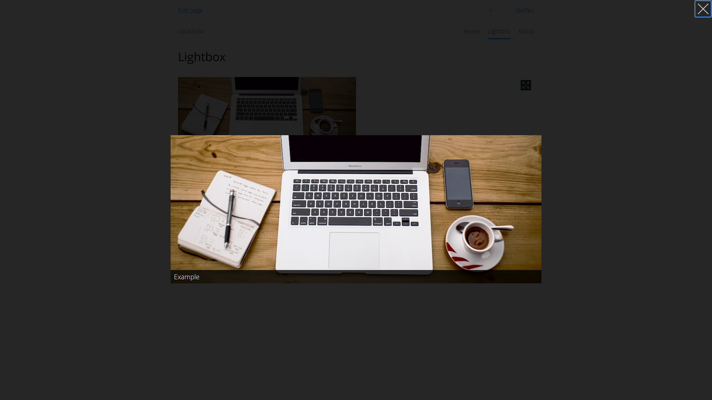

<p align="right"><a href="README-de.md">Deutsch</a> &nbsp; <a href="README.md">English</a></p>

# Lightbox 0.9.3

A lightbox for different media types. 

<p align="center"></p>

## How to install an extension

[Download ZIP file](https://github.com/schulle4u/yellow-lightbox/archive/refs/heads/main.zip) and copy it into your `system/extensions` folder. [Learn more about extensions](https://github.com/annaesvensson/yellow-update).

## How to use a lightbox

Create a `[lightbox]` shortcut.

The following arguments are available, all arguments are optional:

`src` = a file, URL or ID for the supported lightbox modes.  
`label` = label or image caption for the link to open the lightbox.  
`mode` = one of the supported lightbox modes, `image`, `html`, `iframe` or `youtube`  
`group` = the associated group for the media element.  
`width` and `height` = media dimensions if applicable.

## Examples

Open a preview image with lightbox and associate it to the group Yellow: 

    [lightbox /media/images/photo.jpg Example image yellow 50%]

Create a traditional markdown image link to open in lightbox: 

    [[image photo.jpg Example - 50%]](/media/images/photo.jpg){.lightbox}

Play a youtube video:

    [lightbox fhs55HEl-Gc "Play video" youtube]

Open another website as iframe:

    [lightbox https://www.wikipedia.org "Open Wikipedia" iframe - 100%]

Content page with HTML lightbox:

```
---
Title: Example
---
[lightbox selector "Open HTML" html]

<div style="display:none;" markdown=1>

! {#selector}
! This is an example markdown block.  
! [image photo.jpg "You can embed an image too"]

</div>
```

## Settings

The following settings can be configured in file `system/extensions/yellow-system.ini`: 

`LightboxNav` = Show navigation buttons in lightbox, true, false or auto  
 
## Acknowledgements

This extension includes [Tobii 3.0.0 by Midzer](https://github.com/midzer/tobii). Thanks for the good work!

## Developer

Steffen Schultz. [Get help](https://datenstrom.se/yellow/help/).
